# C4 Diagram Images

Pre-rendered images of the C4 mermaid diagrams in
[`../dso-workflow-c4.md`](../dso-workflow-c4.md). The main doc embeds the
mermaid source directly (GitHub renders it inline). This folder exists for
contexts where mermaid won't render — Confluence, Word/PDF export, slide
decks, blog posts, printing — and as a way to view each diagram in
isolation.

| # | Diagram | Source | SVG | PNG |
|---|---------|--------|-----|-----|
| 01 | Skill Entry Decision Tree | [.mmd](01-skill-entry-decision-tree.mmd) | [.svg](01-skill-entry-decision-tree.svg) | [.png](01-skill-entry-decision-tree.png) |
| 02 | Level 1 — System Context | [.mmd](02-level1-system-context.mmd) | [.svg](02-level1-system-context.svg) | [.png](02-level1-system-context.png) |
| 03 | Level 2 — Container | [.mmd](03-level2-container.mmd) | [.svg](03-level2-container.svg) | [.png](03-level2-container.png) |
| 04 | Level 3 — Pipeline (Cross-Skill Flow) | [.mmd](04-level3-pipeline.mmd) | [.svg](04-level3-pipeline.svg) | [.png](04-level3-pipeline.png) |
| 05 | `/dso:brainstorm` Internals | [.mmd](05-brainstorm-internals.mmd) | [.svg](05-brainstorm-internals.svg) | [.png](05-brainstorm-internals.png) |
| 06 | `/dso:preplanning` Internals | [.mmd](06-preplanning-internals.mmd) | [.svg](06-preplanning-internals.svg) | [.png](06-preplanning-internals.png) |
| 07 | `/dso:implementation-plan` Internals | [.mmd](07-implementation-plan-internals.mmd) | [.svg](07-implementation-plan-internals.svg) | [.png](07-implementation-plan-internals.png) |
| 08 | `/dso:sprint` Internals | [.mmd](08-sprint-internals.mmd) | [.svg](08-sprint-internals.svg) | [.png](08-sprint-internals.png) |
| 09 | Cross-Cutting Concerns | [.mmd](09-cross-cutting-concerns.mmd) | [.svg](09-cross-cutting-concerns.svg) | [.png](09-cross-cutting-concerns.png) |
| 10 | Review and Gate Timeline (Idea → Merge) | [.mmd](10-review-gate-timeline.mmd) | [.svg](10-review-gate-timeline.svg) | [.png](10-review-gate-timeline.png) |
| 11 | GitHub Actions Workflow Catalog | [.mmd](11-gha-workflow-catalog.mmd) | [.svg](11-gha-workflow-catalog.svg) | [.png](11-gha-workflow-catalog.png) |
| 12 | `ci.yml` Internals (llm-review orchestrator) | [.mmd](12-ci-yml-internals.mmd) | [.svg](12-ci-yml-internals.svg) | [.png](12-ci-yml-internals.png) |
| 13 | Jira Reconciliation Trio | [.mmd](13-jira-reconciliation-trio.mmd) | [.svg](13-jira-reconciliation-trio.svg) | [.png](13-jira-reconciliation-trio.png) |
| 14 | DSO ↔ CI Integration Sequence (incl. FP-recovery) | [.mmd](14-dso-ci-integration-sequence.mmd) | [.svg](14-dso-ci-integration-sequence.svg) | [.png](14-dso-ci-integration-sequence.png) |

## File formats

- **`.mmd`** — raw mermaid source extracted from the markdown doc. Open in
  [Mermaid Live Editor](https://mermaid.live) to edit and re-render.
- **`.svg`** — vector image with transparent background. Scales infinitely;
  best for embedding in web pages, design tools, and slides.
- **`.png`** — raster image rendered at 2× scale with white background.
  Best for printing, PDFs, and contexts that don't render SVG. Most are
  1568px wide; aspect ratios reflect each diagram's natural shape.

## How these are generated

The images are rendered from `../dso-workflow-c4.md` via
[`@mermaid-js/mermaid-cli`](https://github.com/mermaid-js/mermaid-cli)
(mmdc). When the doc's mermaid blocks change, regenerate by re-extracting
each block to a `.mmd` file and running:

```bash
# Per-block, from this directory:
npx @mermaid-js/mermaid-cli -i <name>.mmd -o <name>.svg -b transparent
npx @mermaid-js/mermaid-cli -i <name>.mmd -o <name>.png -s 2 -b white
```

## Inline previews

The 14 diagrams below — click any to see it full-size.

### 01 — Skill Entry Decision Tree
*Answers "where do I start?" — routes ticket state → command, with back-edges
showing the sprint-as-orchestrator pattern.*


### 02 — Level 1: System Context
*DSO Plugin in its environment: Developer, LLM API, Git/GitHub, GitHub
Actions, Ticket Store, Jira.*

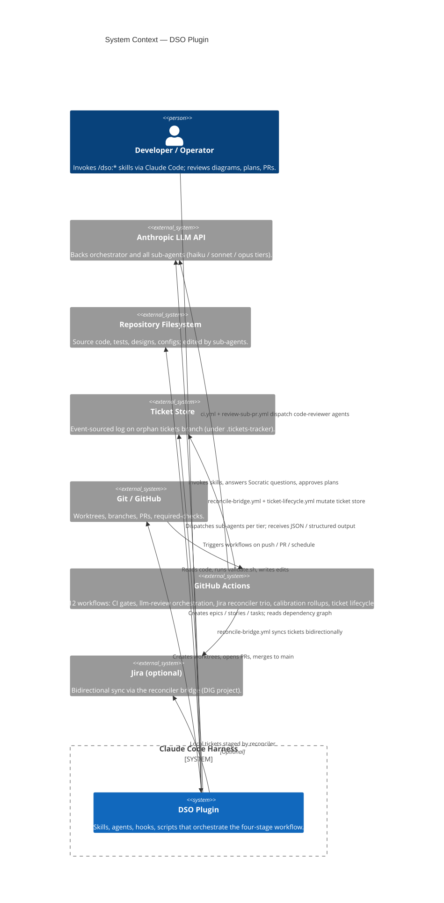

### 03 — Level 2: Container
*Internal subsystems: core skills, supporting skills, named sub-agent pool,
shared workflows, scripts, hooks, ticket event log, GHA workflow groups.*

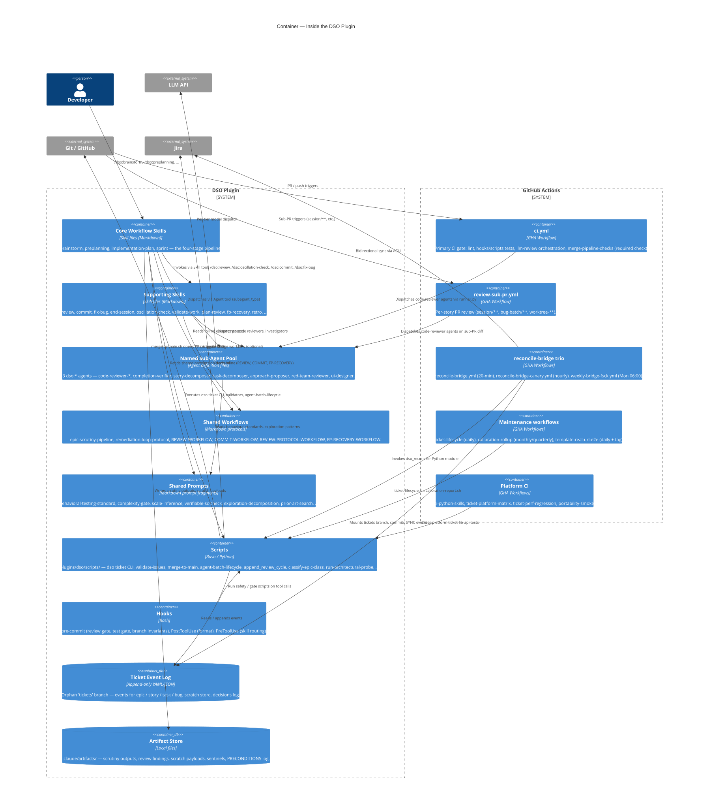

### 04 — Level 3: Pipeline (Cross-Skill Flow)
*Linear happy path: `brainstorm → preplanning → implementation-plan → sprint`
with handoff artifacts.*


### 05 — `/dso:brainstorm` Internals
*Phases 1, 1.5, 2, 3 with the scrutiny pipeline, UI detection, cross-epic
scan, and PIL/preconditions write at close.*


### 06 — `/dso:preplanning` Internals
*Phases A–H: complexity routing, story decomposition (opus), risk scan,
adversarial review, walking skeleton, ticket creation with verify commands.*


### 07 — `/dso:implementation-plan` Internals
*Steps 1–6: contextual discovery, architectural review, task drafting,
plan review, task creation, gap analysis.*


### 08 — `/dso:sprint` Internals
*Phases A–I: init, task analysis, batch prep, sub-agent launch, story
validation, epic validation, remediation, closure.*


### 09 — Cross-Cutting Concerns
*PRECONDITIONS chain, scratch+receipt contract, remediation/oscillation,
pre-commit hooks, REVIEW-WORKFLOW.*


### 10 — Review and Gate Timeline
*All ~21 review/gate points from idea to merge, grouped by skill phase.*


### 11 — GitHub Actions Workflow Catalog
*12 GHA workflows grouped by role: CI Gates, Jira Reconciliation,
Maintenance/Telemetry.*


### 12 — `ci.yml` Internals
*Job graph + llm-review pipeline: cycle tracking, provenance narrowing,
dispatch gate, tier classifier, named code-reviewer agents, liveness gate.*


### 13 — Jira Reconciliation Trio
*`reconcile-bridge.yml` (every 20 min), `reconcile-bridge-canary.yml`
(hourly heartbeat), `weekly-bridge-fsck.yml` (Mon 06:00).*


### 14 — DSO ↔ CI Integration Sequence
*Temporal interleaving of `/dso:sprint`, GitHub, ci.yml, review-sub-pr.yml,
`merge-to-main.sh`, code-reviewer agents, and `/dso:fp-recovery`.*

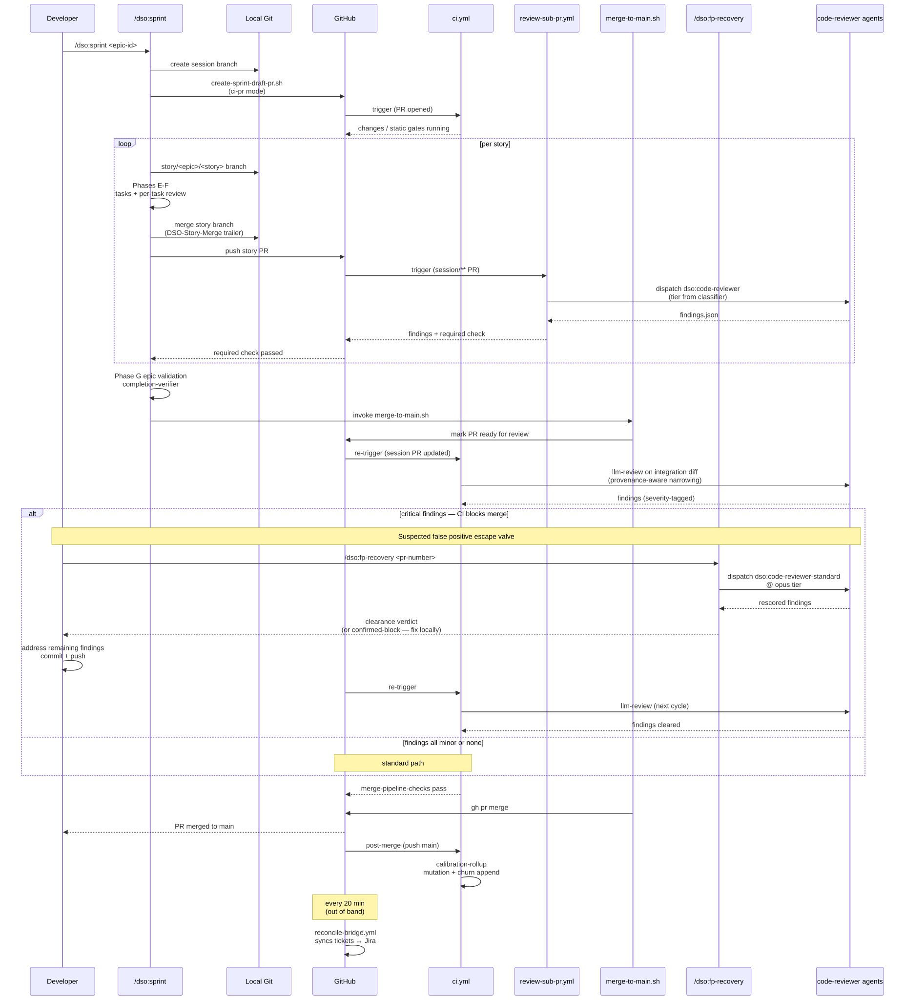
