# DSO Plugin Workflow: C4 Architecture Diagrams

This document maps the agentic software-development workflow implemented by the
Digital Service Orchestra (DSO) plugin, using the [C4 model](https://c4model.com/).

The core workflow is a four-stage pipeline:

```
/dso:brainstorm  →  /dso:preplanning  →  /dso:implementation-plan  →  /dso:sprint
```

Each stage refines the previous stage's output: a feature idea becomes an epic,
the epic decomposes into stories, each story decomposes into TDD tasks, and
those tasks are executed under multi-agent orchestration.

Diagrams progress from highest-level context (Level 1) to per-skill internals
(Level 3). Mermaid C4 directives are used for Levels 1–2; Level 3 uses
flowcharts because per-skill flow has more shape than C4 component diagrams
can represent cleanly.

> **Pre-rendered images** of every diagram below are available under
> [`diagrams/`](diagrams/README.md) (SVG + PNG) for contexts where mermaid
> won't render — Confluence, Word/PDF export, slide decks, printing.

---

## Where Do I Start? — Skill Entry Decision Tree

The four core skills look linear in the pipeline diagram, but in practice
`/dso:sprint` is the most common entry point: it orchestrates the other three
on demand. Use this decision tree to pick the right starting command.

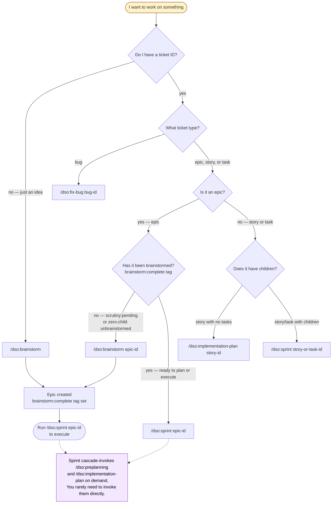

**Cheat sheet** for common situations:

| Situation                                                | Command                                     |
|----------------------------------------------------------|---------------------------------------------|
| Brand-new feature idea, no ticket yet                    | `/dso:brainstorm`                           |
| Existing epic with `scrutiny:pending` tag                | `/dso:brainstorm <epic-id>`                 |
| Existing epic without `brainstorm:complete`              | `/dso:brainstorm <epic-id>`                 |
| Epic ready to execute, has `brainstorm:complete`         | `/dso:sprint <epic-id>` (cascades as needed) |
| Bug or defect to investigate                             | `/dso:fix-bug <bug-id>`                     |
| Story with no tasks (rare — usually do this via sprint)  | `/dso:implementation-plan <story-id>`       |
| Imported Jira ticket (`jira-*` ID)                       | Same as native — type-detection routes it   |

Skill back-edges (less common, but they exist):

- `/dso:sprint` Phase A → `/dso:preplanning` (when story coverage is unmet)
- `/dso:sprint` Phase B → `/dso:implementation-plan` (per story being expanded)
- `/dso:sprint` Phase B cascade → `/dso:brainstorm` (on `REPLAN_ESCALATE: brainstorm`)
- `/dso:preplanning` Phase A.1.5 → `/dso:implementation-plan` (SIMPLE epics skip stories)
- `/dso:implementation-plan` Step 4 / Step 6 → `/dso:oscillation-check` (cycle ≥ 2)

---

## Level 1 — System Context

Shows the DSO plugin in its environment: who uses it and which external
systems it talks to.

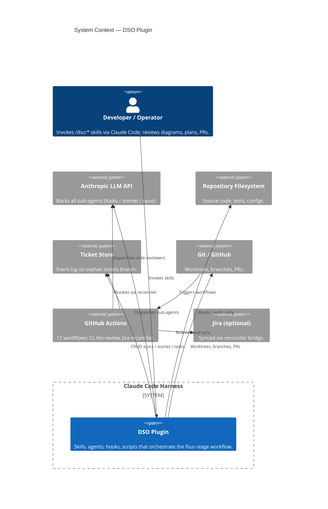

Key contracts at this boundary:

| Surface             | Read                                    | Written by DSO                                                  |
|---------------------|-----------------------------------------|-----------------------------------------------------------------|
| Ticket Store        | `dso ticket show / list / deps`         | `ticket create / transition / tag / comment / link`             |
| Git / GitHub        | branch state, PR diffs, required-checks | new branches, sprint draft PR, merges via `merge-to-main.sh`    |
| Filesystem          | code, configs, design docs              | edits via sub-agent Bash/Edit/Write tools                       |
| LLM API             | model availability                      | structured prompts, JSON envelopes (receipt-only contracts)     |

---

## Level 2 — Container

Shows the major subsystems inside the DSO plugin.

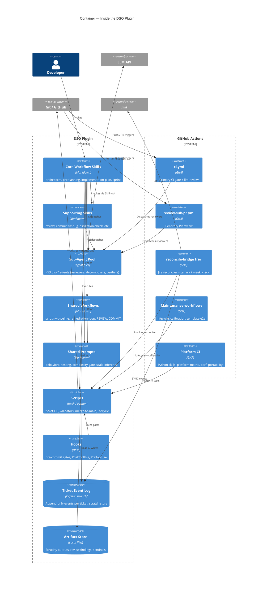

Key cross-container conventions:

- **Sub-agent dispatch**: orchestrator skills use the Agent tool with named
  `subagent_type` values (e.g., `dso:story-decomposer`). Each named agent has
  a fallback path to `subagent_type: "general-purpose"` with the agent file
  read inline.
- **Scratch + receipt contracts**: large sub-agent outputs are written to the
  ticket scratch store and only a 3-field receipt is returned, keeping
  orchestrator context small (`receipt-parse.sh`, `ticket-scratch.sh`).
- **PRECONDITIONS gate**: each stage records its completion via
  `preconditions-record.sh`; the next stage validates via
  `preconditions-validator.sh`. The four-stage pipeline is welded together
  through these gates plus tags (`brainstorm:complete`, `scrutiny:pending`,
  `ui_probes:deferred`, `interaction:deferred`).

---

## Level 3 — Pipeline Components (Cross-Skill Flow)

Shows how the four core skills hand off through the ticket system.

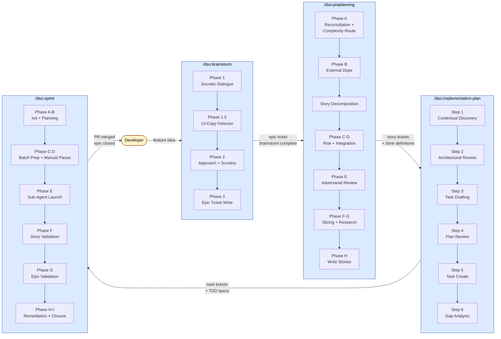

### Handoff artifacts

| From → To              | Artifact                                                                         | Stored where                              |
|------------------------|----------------------------------------------------------------------------------|-------------------------------------------|
| brainstorm → next      | Epic ticket; `brainstorm:complete` tag; `### Planning Intelligence Log` comment | Ticket store                              |
| brainstorm → next      | PRECONDITIONS baseline record (`brainstorm_complete` gate)                       | Ticket events                             |
| brainstorm → next      | `brainstorm-sentinel` file                                                       | Artifact store                            |
| preplanning → impl-plan | Child stories with `## Done Definitions` (each `← Satisfies: sc-N`)            | Ticket store (story tickets)              |
| preplanning → impl-plan | `PREPLANNING_CONTEXT:` comment on epic (schema_version 2)                        | Epic ticket comment                       |
| preplanning → impl-plan | `verify_commands` per DD (from story-decomposer)                                 | Ticket events on each story               |
| impl-plan → sprint     | Task tickets with `## Story DD Coverage` + TDD `testing_mode` + AC               | Ticket store (task tickets)               |
| sprint → user          | Closed epic, merged PR, completion-verifier P1=PASS                              | Ticket store + Git                        |

---

## Level 3 — `/dso:brainstorm` Internals

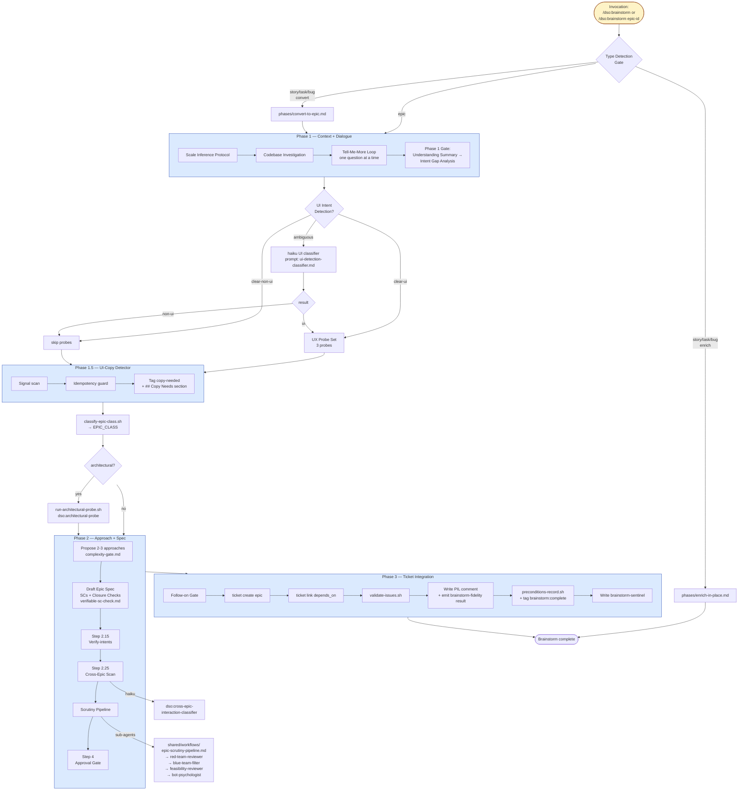

**Sub-agents dispatched** (all via Agent tool):

| Agent                                          | Tier   | Where                       | Purpose                                                       |
|-----------------------------------------------|--------|-----------------------------|---------------------------------------------------------------|
| haiku UI classifier (prompt-only, no named agent) | haiku  | Phase 1.5                   | Ambiguous UI/non-UI classification — `general-purpose` + `prompts/ui-detection-classifier.md` |
| `dso:cross-epic-interaction-classifier`        | haiku  | Step 2.25                   | Detect overlaps with open epics (batched ceil(N/5))           |
| `dso:architectural-probe`                      | opus   | Conditional (architectural) | E2E test scaffold for architectural epics before scrutiny     |
| `dso:red-team-reviewer`                        | opus   | Scrutiny pipeline           | Adversarial epic audit (8-category taxonomy)                  |
| `dso:blue-team-filter`                         | sonnet | Scrutiny pipeline           | Triage red-team findings                                      |
| `dso:feasibility-reviewer`                     | sonnet | Scrutiny pipeline (conditional) | Verify external tool integration feasibility               |
| `dso:bot-psychologist`                         | opus   | Scrutiny Step 5 (conditional)   | Debug LLM-instruction signals                              |
| Agent Clarity / Scope / Value reviewers        | sonnet | Scrutiny Step 4             | Three-axis fidelity review (general-purpose dispatch)         |
| `dso:bug-classifier-haiku`                     | haiku  | Bug-close bookkeeping       | Classify bug ticket slug                                      |

---

## Level 3 — `/dso:preplanning` Internals

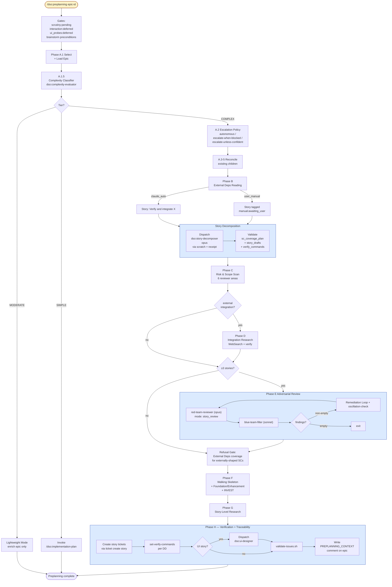

**Sub-agents dispatched**:

| Agent                            | Tier   | Where               | Purpose                                                  |
|----------------------------------|--------|---------------------|----------------------------------------------------------|
| `dso:complexity-evaluator`       | haiku  | A.1.5               | Classify SIMPLE / MODERATE / COMPLEX                     |
| `dso:story-decomposer`           | opus   | Story Decomposition | Draft vertical-slice stories covering every SC           |
| `dso:red-team-reviewer`          | opus   | Phase E             | Cross-story blind spots + 8-category taxonomy            |
| `dso:blue-team-filter`           | sonnet | Phase E             | Triage red-team findings                                 |
| `dso:ui-designer`                | varies | Phase H             | Wireframe / design manifest per UI story                 |

Scripts used: `ticket-scratch.sh`, `receipt-parse.sh`, `append_review_cycle.py`,
`preconditions-validator.sh`, `validate-issues.sh`, `planning-config.sh`,
`classify-sc-shape.sh`, `consult-recipe-registry.sh`.

---

## Level 3 — `/dso:implementation-plan` Internals

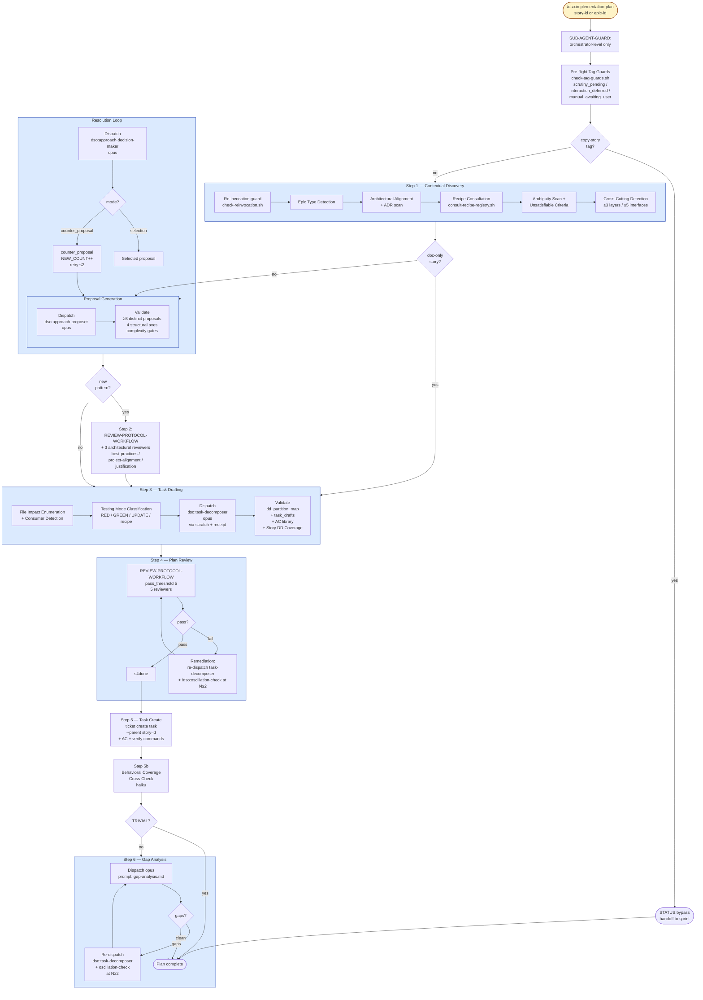

**Sub-agents dispatched**:

| Agent                          | Tier | Where     | Purpose                                              |
|--------------------------------|------|-----------|------------------------------------------------------|
| `dso:approach-proposer`        | opus | Proposal Generation; Step 2 remediation | ≥3 distinct proposals with complexity gates |
| `dso:approach-decision-maker`  | opus | Resolution Loop | Selection / counter-proposal ADR rationale     |
| `dso:task-decomposer`          | opus | Step 3; Step 4 / 6 remediation | Atomic TDD task drafts with AC                |
| opus gap-analysis (prompt-only, no named agent) | opus | Step 6    | Detect Done Definition coverage gaps — `general-purpose` + `prompts/gap-analysis.md` |
| 3 architectural reviewers      | varies | Step 2 (conditional) | best-practices, project-alignment, justification |
| 5 plan reviewers               | varies | Step 4    | task-design, tdd, safety, dependencies, completeness |
| haiku behavioral cross-check   | haiku  | Step 5b   | Validate behavioral DDs have behavioral verify commands |

Skills invoked: `/dso:oscillation-check` (Step 4 and Step 6 cycle ≥2).
Workflows: `REVIEW-PROTOCOL-WORKFLOW.md`, `remediation-loop-protocol.md`.

---

## Level 3 — `/dso:sprint` Internals

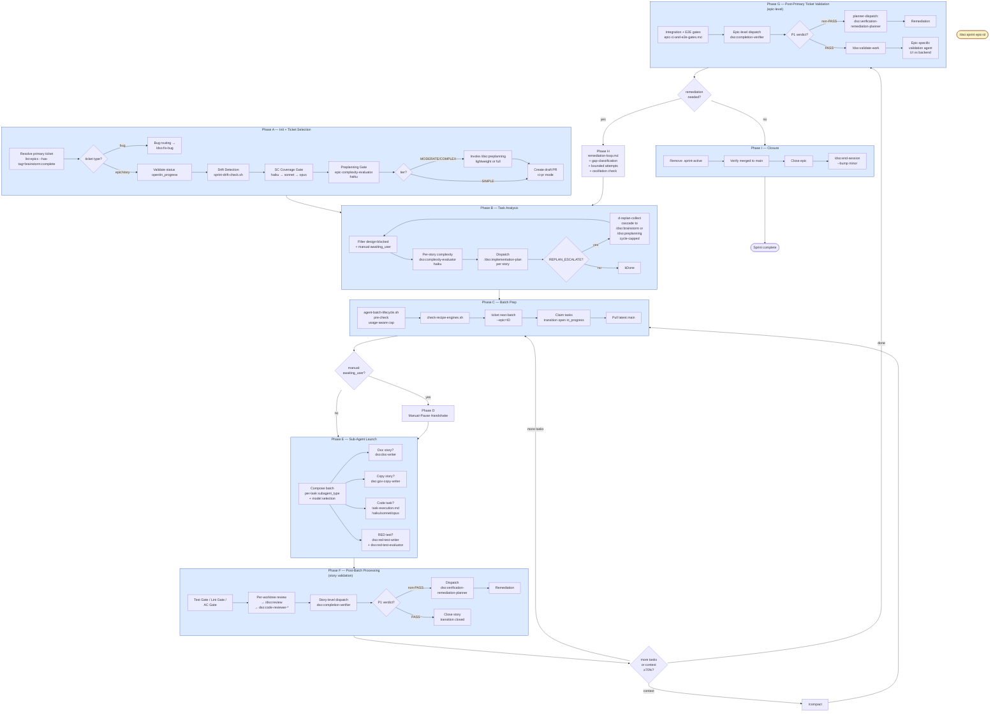

**Sub-agents dispatched** (selected — sprint dispatches many):

| Agent                                    | Tier         | Where                       | Purpose                                                    |
|------------------------------------------|--------------|-----------------------------|------------------------------------------------------------|
| `dso:complexity-evaluator`               | haiku        | Phase A.7, Phase B          | Epic and per-story tier classification                     |
| SC-coverage classifier set                | haiku→sonnet→opus | Phase A.3-A.5         | SC traceability gate (escalating tiers)                    |
| `dso:doc-writer`                         | sonnet       | Phase E                     | Doc stories                                                |
| `dso:gov-copy-writer`                    | sonnet       | Phase E                     | Copy / rewrite stories (federal style canon)               |
| `dso:red-test-writer`                    | sonnet       | Phase E (RED tasks)         | Write failing tests for TDD                                |
| `dso:red-test-evaluator`                 | sonnet       | Phase E (RED tasks)         | Triage red-test results                                    |
| `dso:code-reviewer-{light,standard,deep}` | varies      | Phase F per commit          | Code review via tier classifier                            |
| `dso:completion-verifier`                | sonnet       | Phase F (story), Phase G (epic) | Verify done definitions + success criteria              |
| `dso:verification-remediation-planner`   | opus         | Phase F, G                  | Classify verifier failures, route remediation              |
| Task-execution sub-agents                 | haiku/sonnet/opus | Phase E              | Implement individual tasks                                 |
| `dso:plan-review`                        | sonnet       | Pre-presentation (via /dso:plan-review) | Plan quality gate                                |

Skills invoked: `/dso:implementation-plan` (Phase B), `/dso:preplanning` (Phase A
Preplanning Gate), `/dso:brainstorm` (cascade), `/dso:fix-bug` (bug routing),
`/dso:validate-work` (Phase G), `/dso:end-session` (Phase I), `/dso:review`
(per-commit), `/dso:oscillation-check` (Phase H).

Workflows: `remediation-loop.md`, `remediation-loop-protocol.md`,
`REVIEW-WORKFLOW.md`, `COMMIT-WORKFLOW.md`, `TEST-FAILURE-DISPATCH.md`,
`epic-ci-and-e2e-gates.md`.

---

## Cross-Cutting Concerns

The diagrams above intentionally don't repeat patterns that apply throughout the
plugin. The most important cross-cutting mechanisms:

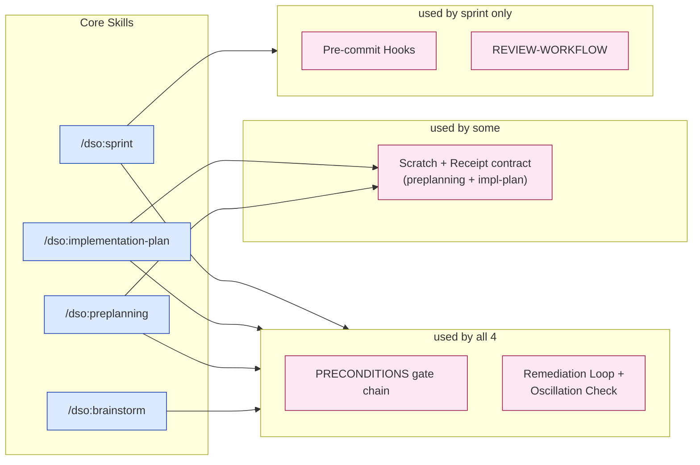

| Mechanism                              | Purpose                                                                                  |
|----------------------------------------|------------------------------------------------------------------------------------------|
| PRECONDITIONS gate chain               | Each stage records a baseline; the next validates it before starting                     |
| Scratch + receipt contract             | Sub-agents write large payloads to scratch and return only a 3-field receipt             |
| Remediation Loop + Oscillation Check   | Bounded-cycle protocol with hard gate at N ≥ 2 to prevent revert-flip-flop               |
| Pre-commit hooks                       | Block raw commits, enforce review gate, test gate, story-branch invariant                |
| REVIEW-WORKFLOW tier classifier        | Deterministic light / standard / deep / opus selection from diff complexity              |

---

## Review and Gate Timeline (Idea → Merge)

The per-skill diagrams each show their local review/gate. This diagram
consolidates **every** review, gate, and verification point along the path
from a feature idea to a merged PR, in execution order. Each box names the
mechanism and the sub-agent or hook responsible.

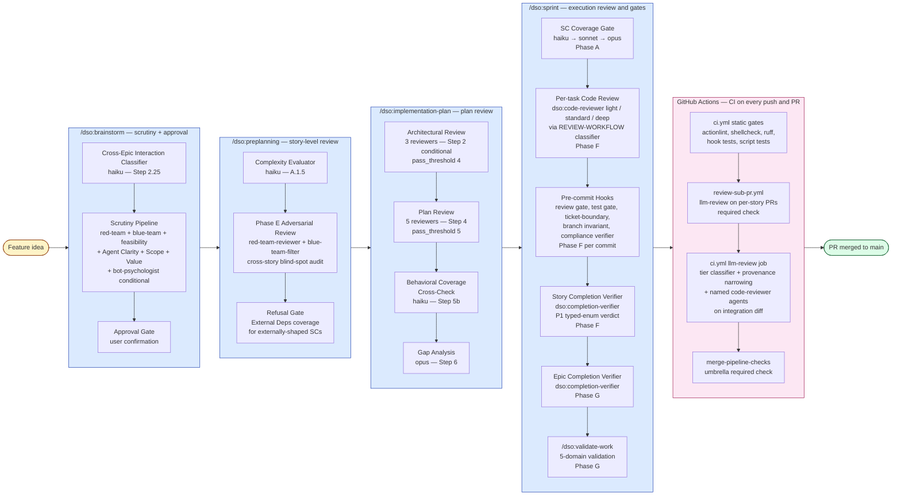

**Approximate review-point count along the happy path**: 4 in brainstorm, 3 in
preplanning, 4 in implementation-plan, 6 in sprint, 4 in CI = **~21 distinct
gate or review evaluations** between idea and merge. Most are scoped (only
fire when their preconditions are met — e.g., Phase E adversarial review only
fires when there are ≥ 3 stories; architectural review only fires when a new
pattern is proposed). Typical end-to-end runs encounter 8–12 of these.

**Failure routes** (not shown above, see per-skill diagrams):

- A failed review enters the **remediation loop** (`remediation-loop-protocol.md`)
  with a bounded cycle cap and an `/dso:oscillation-check` hard gate at cycle ≥ 2.
- Story-level verifier `P1 ≠ PASS` routes through `dso:verification-remediation-planner`
  which classifies the failure and emits one of four scopes: `replan_story`,
  `new_tasks_in_story`, `new_story_in_epic`, or `replan_epic`.
- CI `llm-review` blocking on a suspect false positive escapes via
  `/dso:fp-recovery <pr-number>` (opus-tier reviewer rerun).
- Catastrophic failure escapes via `REPLAN_ESCALATE: <upstream>` which routes
  back to `/dso:brainstorm` or `/dso:preplanning`.

---

## Level 3 — GitHub Actions Workflow Catalog

The DSO plugin is supported by 12 GitHub Actions workflows that fall into four
roles. Together they enforce the CI gate, sync with Jira, advance ticket
lifecycle, and produce telemetry rollups.

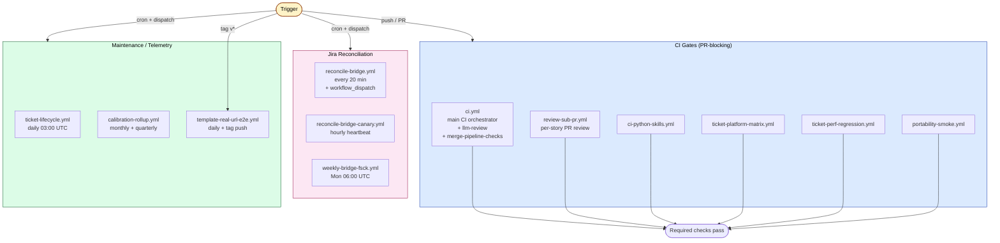

### Workflow catalog (authoritative)

| Workflow                          | Trigger                                                          | Purpose                                                                                                                  | Required check?    |
|-----------------------------------|------------------------------------------------------------------|--------------------------------------------------------------------------------------------------------------------------|--------------------|
| `ci.yml`                          | push (main, feature/**, etc.), PR (all), workflow_dispatch       | Lint + hooks/scripts tests + llm-review orchestration + `merge-pipeline-checks` umbrella                                  | yes (umbrella)     |
| `review-sub-pr.yml`               | PR on `session/**`, `bug-batch/**`, `worktree-**`                | LLM code review on sub-PR diff; writes `findings.json`                                                                    | yes (per-story)    |
| `ci-python-skills.yml`            | push main / feature/* / bugfix/* / epic/* / exp/* / PR / dispatch | pytest of Python skills + Sphinx docs build                                                                              | yes                |
| `ticket-platform-matrix.yml`      | push main (ticket-lib-api.sh paths), PR, dispatch                 | Cross-platform ticket lib tests: bash4/Ubuntu, bash3/macOS, busybox/Alpine                                               | yes                |
| `ticket-perf-regression.yml`      | push main (ticket-lib-api.sh paths), PR (same paths)              | hyperfine benchmarks of `ticket-lib-api.sh` + sprint workflow                                                            | yes                |
| `portability-smoke.yml`           | push main, PR                                                    | dso shim self-detection in fresh Ubuntu                                                                                   | yes                |
| `reconcile-bridge.yml`            | every 20 min cron + dispatch (modes: dry-run / bootstrap-strict / bootstrap-throttle / live) | Bidirectional Jira ↔ ticket-store reconciler via ACLI + `dso_reconciler` Python module                                   | no (background)    |
| `reconcile-bridge-canary.yml`     | hourly cron + dispatch                                           | Heartbeat: if last successful reconcile-bridge run > 2 h, file/continue/close a heartbeat-alert bug ticket               | no (alerting)      |
| `weekly-bridge-fsck.yml`          | Mon 06:00 UTC cron + dispatch                                    | Audit ticket store for orphan jira_key mappings, duplicate Jira mappings, stale SYNC events, unresolved BRIDGE_ALERTs    | no (audit)         |
| `ticket-lifecycle.yml`            | daily 03:00 UTC cron + dispatch                                  | Advance ticket state machine (auto-close stale tickets, process lifecycle events)                                        | no                 |
| `calibration-rollup.yml`          | push main + monthly cron + quarterly cron                        | Append mutation + churn calibration records on merge; generate monthly/quarterly rollup reports                          | no                 |
| `template-real-url-e2e.yml`       | daily 06:00 UTC cron + tag push `v*` + dispatch                  | E2E real-clone validation of the NextJS template repo against the contract spec                                          | release-gate       |

---

## Level 3 — `ci.yml` Internals (the llm-review orchestrator)

The primary CI workflow runs both static gates and a multi-step LLM review
orchestration. Below shows the job graph and the llm-review pipeline.

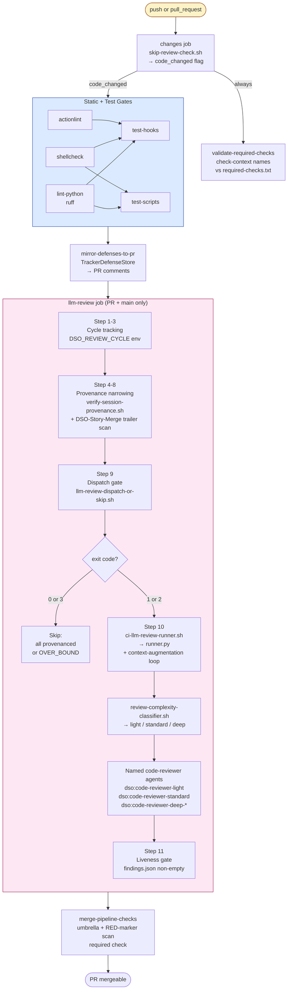

**Key contracts**:

| Contract               | Description                                                                                                                       |
|------------------------|-----------------------------------------------------------------------------------------------------------------------------------|
| `DSO_REVIEW_CYCLE`     | Cycle counter from prior `## DSO llm-review — finding N` headers; consumed by `runner.py` for two-call architecture on cycle ≥ 2  |
| Provenance narrowing   | Classifies commits as provenanced (traced to a story PR via `DSO-Story-Merge:` trailer) vs unprovenanced                          |
| OVER_BOUND (exit 3)    | Provenance check signal: high-complexity integration, skip review (escape valve)                                                  |
| `findings.json`        | Reviewer output written by sub-agent; liveness-gated in Step 11 (catches silent exit-0)                                           |
| `TrackerDefenseStore`  | Prior defenses stored on `tickets` orphan branch; mirrored to PR via `mirror-defenses-to-pr` job                                  |
| Tier classifier        | `review-complexity-classifier.sh` — deterministic light/standard/deep selection (no LLM call); FP-recovery escape opens opus tier |

**Integration with the four core skills**:

- `/dso:sprint` Phase A creates a draft PR (`create-sprint-draft-pr.sh`) which
  starts the CI clock. Per-story merges into the session branch trigger
  `review-sub-pr.yml`, each writing a `DSO-Story-Merge:` trailer.
- `/dso:commit` and `/dso:review` write `reviewer-findings.json` locally; CI
  re-runs `ci-llm-review-runner.sh` on the integration diff and compares.
- `/dso:fp-recovery <pr-number>` is the escape valve when CI llm-review blocks
  on a suspected false positive — runs `dso:code-reviewer-standard` at opus
  tier on the PR diff.
- `merge-to-main.sh` (invoked by `/dso:sprint` Phase I or `/dso:end-session`)
  waits for `merge-pipeline-checks` to clear before merging.

---

## Level 3 — Jira Reconciliation Trio

```mermaid
flowchart TB
  cronA[(cron */20 min)]:::cron
  cronB[(cron hourly)]:::cron
  cronC[(cron Mon 06:00 UTC)]:::cron
  disp[(workflow_dispatch<br/>modes: dry-run / bootstrap / live)]:::dispatch

  subgraph rb["reconcile-bridge.yml"]
    rb1[Pre-flight: BRIDGE_ENV_ID<br/>+ __main__.py exists]
    rb2[Mount tickets worktree]
    rb3[Install requirements.lock<br/>+ download ACLI<br/>SHA256 verify]
    rb4[acli jira auth login]
    rb5[Set bridge bot git identity]
    rb6[python -m dso_reconciler<br/>--mode MODE]
    rb7[Commit + fetch-rebase-push<br/>5-retry exponential backoff]
    rb8[Failure alert →<br/>chronic-failure ticket]
    rb1 --> rb2 --> rb3 --> rb4 --> rb5 --> rb6 --> rb7
    rb6 -.->|on failure| rb8
  end

  subgraph rbc["reconcile-bridge-canary.yml"]
    rbc1[GitHub API: last<br/>successful rb run]
    rbc2{stale<br/>>2h?}
    rbc3[Open / continue<br/>heartbeat-alert ticket]
    rbc4[Close ticket on recovery]
    rbc5[Exit 1 on stale<br/>→ GHA failure UI]
    rbc1 --> rbc2
    rbc2 -->|stale| rbc3 --> rbc5
    rbc2 -->|healthy + ticket open| rbc4
  end

  subgraph fsck["weekly-bridge-fsck.yml"]
    f1[Mount tickets worktree]
    f2[python ticket-bridge-fsck.py]
    f3[Detect orphan jira_keys<br/>+ duplicate mappings<br/>+ stale SYNC events<br/>+ unresolved alerts]
    f4[Exit 1 on anomalies<br/>→ on-call investigates]
    f1 --> f2 --> f3 --> f4
  end

  cronA --> rb
  disp --> rb
  cronB --> rbc
  cronC --> fsck

  rbc -.->|reads run history| ghapi[(GitHub Actions API)]
  rb -.->|writes SYNC events| store[(tickets branch)]
  fsck -.->|reads events| store
  rbc -.->|opens / closes tickets| store
  rb -.->|bidirectional ACLI sync| jira[(Jira / DIG project)]

  classDef cron fill:#fef3c7,stroke:#92400e,color:#000
  classDef dispatch fill:#fef3c7,stroke:#92400e,color:#000
  classDef workflow fill:#fce7f3,stroke:#9d174d,color:#000
  class rb,rbc,fsck workflow
```

**Relationships**: `reconcile-bridge.yml` is the **active healer** (writes
events both ways); `reconcile-bridge-canary.yml` is a **passive monitor**
(opens a heartbeat-alert ticket if the active healer goes silent for >2 h);
`weekly-bridge-fsck.yml` is a **passive auditor** (surfaces ledger anomalies
weekly for human investigation). The canary is NOT a staging tier — modes for
gradual rollout / rollback are operator-selected via `workflow_dispatch` on
the main reconciler.

---

## DSO ↔ CI Integration Sequence

This sequence shows how `/dso:sprint` interacts with GitHub Actions across a
full epic execution.

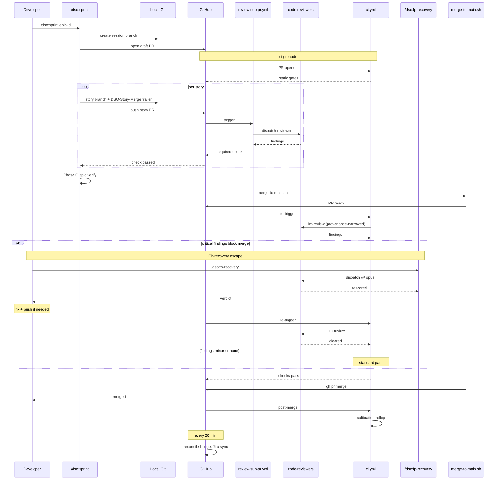

**Workflow → Skill triggers (table)**:

| Workflow / Action                       | Triggered by                                  | Affects DSO skill                                       |
|----------------------------------------|-----------------------------------------------|---------------------------------------------------------|
| `ci.yml` (PR)                          | `/dso:sprint` Phase A draft PR creation       | Findings feed `/dso:review` autonomous resolution loop  |
| `review-sub-pr.yml`                    | Per-story PR merge during `/dso:sprint`       | Required-check for story PR merge                        |
| `ci.yml` (post-merge)                  | `merge-to-main.sh` final merge                | Adds calibration telemetry                              |
| `reconcile-bridge.yml`                 | cron / dispatch (out of band)                 | Adds Jira-mirror events visible to all skills           |
| `ticket-lifecycle.yml`                 | daily cron                                    | Auto-closes stale tickets; affects `/dso:retro` outputs |
| `template-real-url-e2e.yml`            | tag `v*` (release)                            | Gates release artifact for downstream consumers         |

---

## Reading Guide

- **For a quick mental model**: read Level 1 + the pipeline flowchart in Level 3.
- **For "where do I start?"**: read the Skill Entry Decision Tree near the top.
  It maps ticket state → command and lists the back-edges so the sprint-as-
  orchestrator pattern is explicit.
- **For "where will my work be reviewed?"**: read the Review and Gate Timeline
  after Cross-Cutting Concerns. It consolidates all ~21 review/gate points
  along the path from idea to merge.
- **For operating the plugin**: read each per-skill Level 3 diagram; trace
  which sub-agents fire and what each phase produces.
- **For modifying the plugin**: also consult the underlying SKILL.md files
  (`plugins/dso/skills/{brainstorm,preplanning,implementation-plan,sprint}/SKILL.md`),
  agent definitions (`plugins/dso/agents/*.md`), and workflow files
  (`plugins/dso/docs/workflows/`, `plugins/dso/skills/shared/workflows/`).
- **For sub-agent details**: the named agent table in `plugins/dso/docs/AGENTS.md`
  is the authoritative reference for tier, scope, and authority.
- **For CI / GitHub Actions**: read the Workflow Catalog section and the
  `ci.yml` internals diagram; for Jira sync, the reconciler trio diagram.
  The DSO ↔ CI sequence shows how `/dso:sprint` and CI interact across an
  epic execution.
