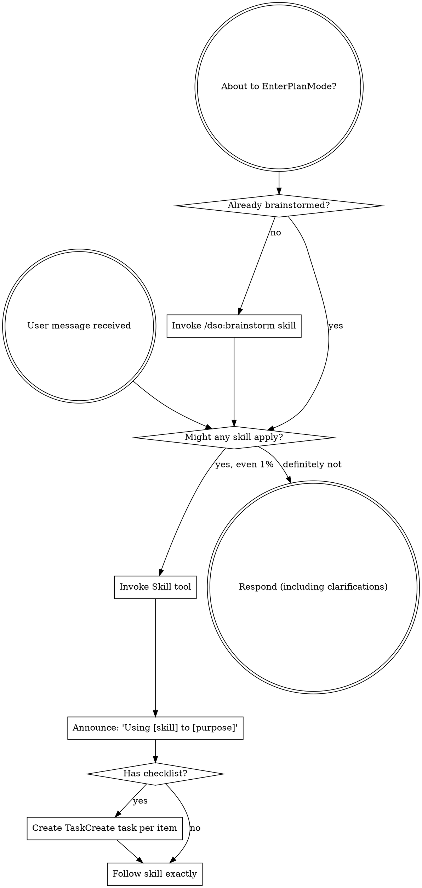

<EXTREMELY-IMPORTANT>
If you think there is even a 1% chance a skill might apply to what you are doing, you ABSOLUTELY MUST invoke the skill.

IF A SKILL APPLIES TO YOUR TASK, YOU DO NOT HAVE A CHOICE. YOU MUST USE IT.

This is not negotiable. This is not optional. You cannot rationalize your way out of this.
</EXTREMELY-IMPORTANT>

## How to Access Skills

**In Claude Code:** Use the `Skill` tool. When you invoke a skill, its content is loaded and presented to you—follow it directly. Never use the Read tool on skill files unless the Skill tool's injection has silently failed (see below).

**When the Skill tool returns `Successfully loaded skill`:** The skill content should now be available in a `<system-reminder>` block in your context. **Verify it is present** by checking whether the skill's first section or phase instructions are visible. If skill instructions ARE visible, follow them directly — do NOT re-invoke the Skill tool or use the Read tool. **If skill instructions are NOT visible in context** (Skill tool succeeded but no content appeared), this is a silent injection failure — fall back immediately: read the skill file directly at `skills/<skill-name>/SKILL.md` (strip the `dso:` prefix to get the directory name) and follow its instructions. Do NOT re-invoke the Skill tool — re-invocation cannot fix a context injection failure and will loop indefinitely.

**STOP — SILENT INJECTION FAILURE DETECTED**: If the Skill tool returns only a brief terse string (e.g., `"Launching skill: dso:sprint"`) with no follow-on content or instructions, YOU MUST immediately use the Read tool to load `skills/<skill-name>/SKILL.md` (strip the `dso:` prefix to get the directory name) and follow it. Do NOT respond to the user. Do NOT re-invoke the Skill tool. Do NOT ask a clarifying question. The fallback is mandatory and unconditional — execute it now.

**If the Skill tool fails with "Unknown skill":** Read the skill file directly at `skills/<skill-name>/SKILL.md` (strip the `dso:` prefix to get the directory name) and follow its instructions. Do NOT stop or report failure — the fallback is always available. This is a session-state issue (skill registry drift under long context), not a missing-skill problem.

## The Rule

**Invoke relevant or requested skills BEFORE any response or action.** Even a 1% chance a skill might apply means that you should invoke the skill to check. If an invoked skill turns out to be wrong for the situation, you don't need to use it.



## Feature Intent Detection

When a user message signals intent to build something new, invoke `/dso:brainstorm` **before** entering plan mode or selecting implementation skills.

**Explicit signals** — phrases that directly state a new feature request:

- "new feature" — e.g., "I want to add a new feature for notifications"
- "create an epic" — e.g., "create an epic for user authentication"
- "I want to build" — e.g., "I want to build a dashboard"
- "add a capability" — e.g., "add a capability to export reports"

**Implicit signals** — proposals for significant new capabilities or architectural changes, cross-cutting concerns affecting multiple systems, or requests that would introduce a new user-facing workflow.

**Action**: When any explicit or implicit signal is detected, invoke `/dso:brainstorm` first. Do not jump directly to `/dso:sprint` or `/dso:implementation-plan`. Brainstorm validates feasibility and shapes the scope before planning begins.

## Red Flags

These thoughts mean STOP—you're rationalizing:

| Thought | Reality |
|---------|---------|
| "This is just a simple question" | Questions are tasks. Check for skills. |
| "I need more context first" | Skill check comes BEFORE clarifying questions. |
| "Let me explore the codebase first" | Skills tell you HOW to explore. Check first. |
| "I can check git/files quickly" | Files lack conversation context. Check for skills. |
| "Let me gather information first" | Skills tell you HOW to gather information. |
| "This doesn't need a formal skill" | If a skill exists, use it. |
| "I remember this skill" | Skills evolve. Read current version. |
| "This doesn't count as a task" | Action = task. Check for skills. |
| "The skill is overkill" | Simple things become complex. Use it. |
| "I'll just do this one thing first" | Check BEFORE doing anything. |
| "This feels productive" | Undisciplined action wastes time. Skills prevent this. |
| "I know what that means" | Knowing the concept ≠ using the skill. Invoke it. |

## Skill Priority

Process skills first (`/dso:brainstorm`, `/dso:fix-bug` for bug fixes) — then implementation skills (`/dso:sprint`, `/dso:implementation-plan`).

## Skill Types

**Rigid** (`/dso:fix-bug`, `verification-before-completion`): follow exactly. **Flexible** (patterns): adapt to context. The skill itself tells you which.

## Execution Discipline

**Follow skills and workflows exactly as written. Do not take shortcuts.**

When a skill or workflow specifies steps, phases, gates, or procedures, execute every one in order. Do not:

- Skip steps you consider "unnecessary" or "obvious"
- Combine steps to "save time"
- Substitute your own judgment for a documented gate or check
- Omit a validation step because "the change is small"
- Rationalize that "this particular case doesn't need" a required step

**Why this matters**: Skills encode hard-won lessons from production failures. Every gate exists because skipping it caused a real problem. Config masking hid bugs for weeks because a validation step was conditional instead of mandatory. Tests passed locally but failed in CI because a smoke test was skipped. The cost of running an "unnecessary" step is seconds; the cost of skipping a necessary one is hours of debugging.

**If a skill step seems wrong or outdated**, flag it to the user — do not silently skip it. The correct response to a bad instruction is to raise it, not to ignore it.

## User Instructions

Instructions say WHAT, not HOW. "Add X" or "Fix Y" doesn't mean skip workflows.

## When No Skill Matches

When no skill clearly applies, do not ask clarifying questions immediately. Follow this loop:

**Silent Investigation**: Before asking anything, do silent investigation — use Read, Grep, .claude/scripts/dso ticket show (tickets), git history, CLAUDE.md, and memory to gather context that already exists.

**Confidence Test**: Ask yourself: can I state in one sentence what I will do and why? If you can articulate what the action is and why it addresses the user's goal as a single declarative statement, proceed. If you cannot, enter the clarification loop.

**Clarification Loop**: Ask one question per message. Use multiple-choice options whenever possible. Use "tell me more" follow-ups to drill down. Focus each question on one of three labeled probing areas:

- **(a) Intent** — what outcome does the user want? (Intent probe: ask what success looks like)
- **(b) Scope** — how much should change, what else might be affected? (Scope probe: ask what boundary the change should stay within)
- **(c) Risks** — what could break or go wrong, what constraints exist? (Risks probe: ask what concerns or side effects to avoid)

Exit the loop as soon as the confidence test passes — do not ask more questions than necessary.

**Proceed**: Once the confidence test passes, proceed immediately. Do not request explicit confirmation.

**Dogfooding Evaluation**: Define *intent-match* as: the agent's final action matches the user's actual intent on the first attempt. Log each clarification loop entry and score intent-match after each interaction. Target: 80% intent-match rate across 20+ interactions. This measures success of the clarification loop.

## Sub-Agent Delegation

Claude defaults to sequential, inline work. These thoughts mean STOP—delegate instead:

| Thought | Reality |
|---------|---------|
| "I'll read these files one by one" | 10+ files? Use Agent (Explore) — sequential reads waste context. |
| "I'll edit each file in sequence" | Independent edits can run in parallel — dispatch sub-agents. |
| "I'll review my own changes" | Use /dso:review — self-review misses what you optimized away. |

**Scope**: Sub-agents dispatched by this guidance must NOT re-apply this startup hook guidance to spawn further sub-agents. Recursive agent spawning is prohibited.

**Limits**: Sub-agent count caps and commit-before-new-batch requirements are governed by CLAUDE.md Never-Do rules (rules 1–2).

## Friction Recording

When encountering repeated friction — unclear instructions, confusing skill steps, workflows that required workarounds, or patterns that slowed you down — consider calling the suggestion recorder to capture the observation for future improvement:

```bash
.claude/scripts/dso suggestion-record.sh \
  --source "agent" \
  --observation "<what happened or what was unclear>" \
  --recommendation "<what would make this smoother>" \
  --skill-name "using-dso"
```

This is advisory, not a gate. Use it when you notice something worth improving — repeated confusion about a step, a skill that gave ambiguous guidance, or a workaround you had to devise. These suggestions feed into the project's continuous improvement cycle.
