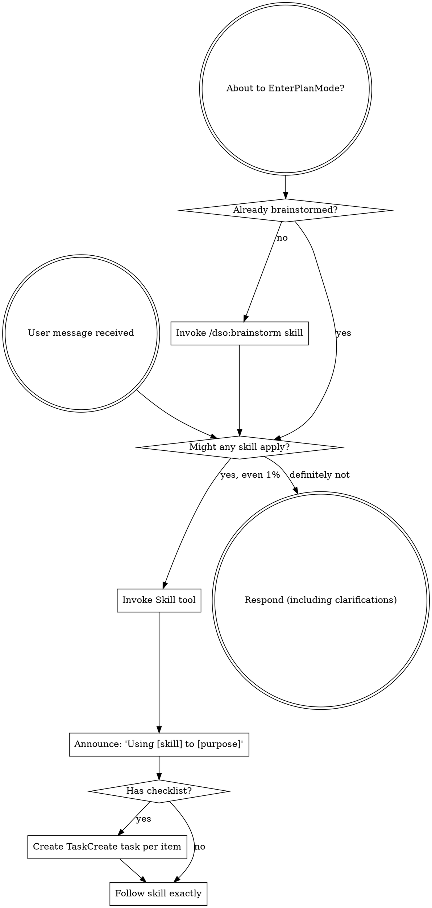

<EXTREMELY-IMPORTANT>
If you think there is even a 1% chance a skill might apply to what you are doing, you ABSOLUTELY MUST invoke the skill.

IF A SKILL APPLIES TO YOUR TASK, YOU DO NOT HAVE A CHOICE. YOU MUST USE IT.

This is not negotiable. This is not optional. You cannot rationalize your way out of this.
</EXTREMELY-IMPORTANT>

## How to Access Skills

**In Claude Code:** Use the `Skill` tool. When you invoke a skill, its content is loaded and presented to you—follow it directly. Never use the Read tool on skill files.

## The Rule

**Invoke relevant or requested skills BEFORE any response or action.** Even a 1% chance a skill might apply means that you should invoke the skill to check. If an invoked skill turns out to be wrong for the situation, you don't need to use it.

## Red Flags

These thoughts mean STOP—you're rationalizing:

| Thought | Reality |
|---------|---------|
| "This is just a simple question" | Questions are tasks. Check for skills. |
| "I need more context first" | Skill check comes BEFORE clarifying questions. |
| "Let me explore the codebase first" | Skills tell you HOW to explore. Check first. |
| "I can check git/files quickly" | Files lack conversation context. Check for skills. |
| "Let me gather information first" | Skills tell you HOW to gather information. |
| "This doesn't need a formal skill" | If a skill exists, use it. |
| "I remember this skill" | Skills evolve. Read current version. |
| "This doesn't count as a task" | Action = task. Check for skills. |
| "The skill is overkill" | Simple things become complex. Use it. |
| "I'll just do this one thing first" | Check BEFORE doing anything. |
| "This feels productive" | Undisciplined action wastes time. Skills prevent this. |
| "I know what that means" | Knowing the concept ≠ using the skill. Invoke it. |

## Skill Priority

Process skills first (`/dso:brainstorm`, `/dso:fix-bug` for bug fixes, `/dso:tdd-workflow` for new feature TDD) — then implementation skills (`/dso:sprint`, `/dso:implementation-plan`).

## Skill Types

**Rigid** (`/dso:fix-bug`, `/dso:tdd-workflow`, `verification-before-completion`): follow exactly. **Flexible** (patterns): adapt to context. The skill itself tells you which.

## Execution Discipline

**Follow skills and workflows exactly as written. Do not take shortcuts.**

When a skill or workflow specifies steps, phases, gates, or procedures, execute every one in order. Do not:

- Skip steps you consider "unnecessary" or "obvious"
- Combine steps to "save time"
- Substitute your own judgment for a documented gate or check
- Omit a validation step because "the change is small"
- Rationalize that "this particular case doesn't need" a required step

**Why this matters**: Skills encode hard-won lessons from production failures. Every gate exists because skipping it caused a real problem. Config masking hid bugs for weeks because a validation step was conditional instead of mandatory. Tests passed locally but failed in CI because a smoke test was skipped. The cost of running an "unnecessary" step is seconds; the cost of skipping a necessary one is hours of debugging.

**If a skill step seems wrong or outdated**, flag it to the user — do not silently skip it. The correct response to a bad instruction is to raise it, not to ignore it.

## User Instructions

Instructions say WHAT, not HOW. "Add X" or "Fix Y" doesn't mean skip workflows.
